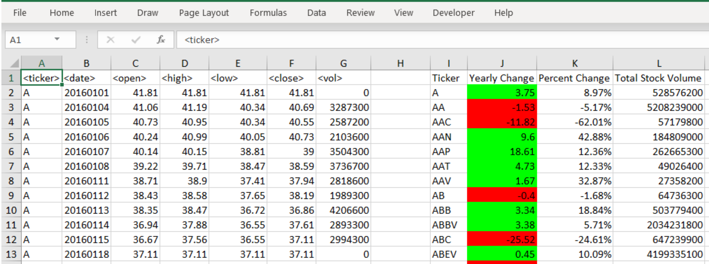

# Stock Market Analysis with Excel VBA

Stock market data analysis with Excel VBA scripting.

## Steps

- Create a script that loops through all the stocks for one year.
- Output:
  - The ticker symbol.
  - Yearly change from opening price at the beginning of a given year to the closing price at the end of that year.
  - The percent change from opening price at the beginning of a given year to the closing price at the end of that year.
  - The total stock volume of the stock.
- Conditional formatting that highlights positive change in green and negative change in red.

## Output

## Data

- Test Data - Used while developing scripts.
- Stock Data – Data to generate the final report.

## Authors

- **David W. Mueller**
  - [LinkedIn Profile](https://www.linkedin.com/in/davidwaltermueller/)
  - davemuelle@gmail.com

## Acknowledgments

- Michigan State University Data Analytics Bootcamp; March 28, 2021.
